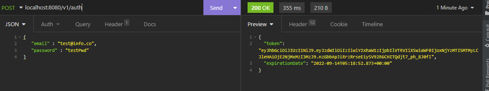

# labIETI03

## Part 1:

+ Secured Endpoint User by Id:

+ Open Endpoint User's List:


## Part 2:

+ ***Creación de usuario de prueba:***


Algo que podemos observar es que el dto que retorna tiene la contraseña null, esto es debido a que el mapper
encripta y agrega a la entidad y bueno al mapear de vuelta no obtiene el está propiedad 

*Usuario en BD*:


+ ***Auth Endpoint:***


## Part 3:

+ ***Auth Endpoint:***



```
Token = eyJhbGciOiJIUzI1NiJ9.eyJzdWIiOiIzIiwiY2xhaW1zIjpbIlVTRVIiXSwiaWF
0IjoxNjYzMTI5MTMyLCJleHAiOjE2NjMxMzI3MzJ9.nzGbbApJiRrzRrseEiySV92R6CHITQdjt7_ph_8J0fI
```

+ ***Get with auth:***

